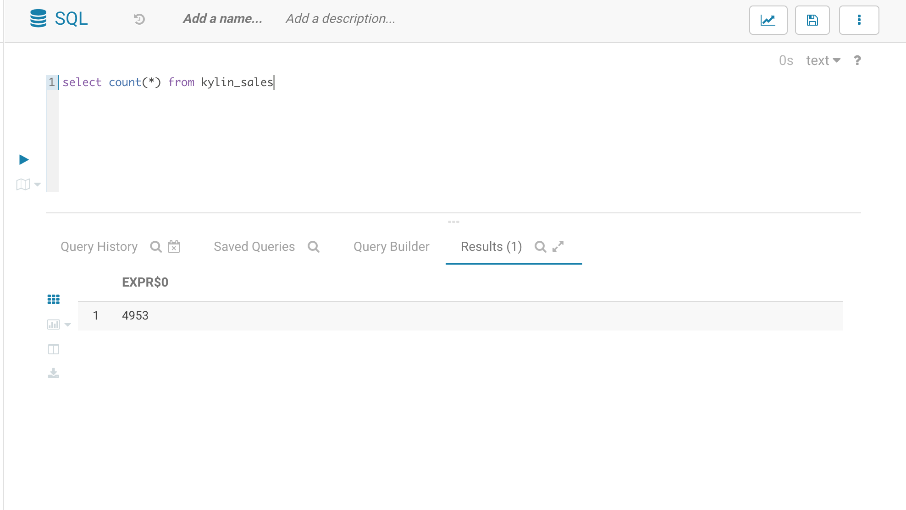
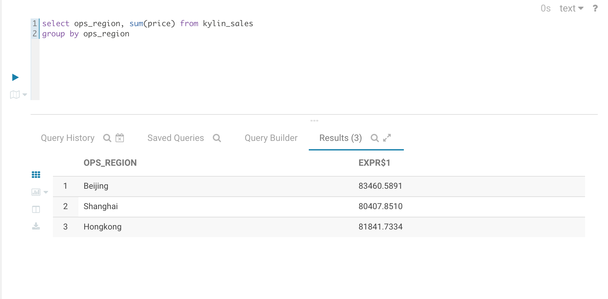
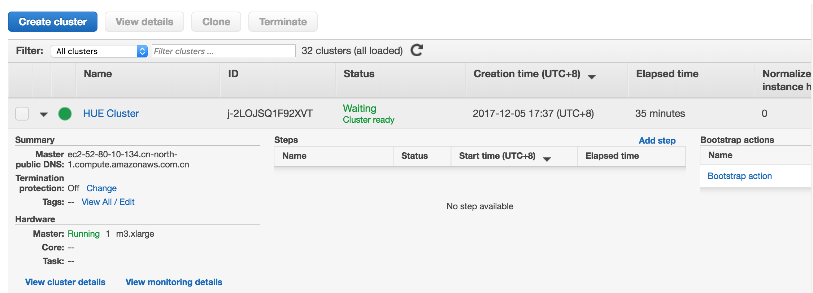

## Using Hue to interact with Apache Kylin

### What is Apache Kylin

Apache Kylin is a leading open-source online analytical processing (OLAP) engine that’s built for interactive
analytics for Big Data. It provides an ANSI-SQL interface and multi-dimensional OLAP for massive datasets. It supports consuming data in batch and streaming and offers sub-second query latency on petabyte-scale dataset. It seamlessly integrates with BI tools via ODBC driver, JDBC driver, and REST API.

### What is Hue

Hue is a very easy-to-use SQL editor that allows you to query Hadoop-based service using a user-friendly web-based interface. Hue makes access big data on Hadoop easier for Analysts as SQL is the most familiar language analysts could use.

In this post, we will demonstrate how you can connect Hue to Apache Kylin and get quick insight from huge volume data in seconds.

### Build Docker Image of Hue with Apache Kylin

#### Prepare hue image

Use docker to pull the latest hue.

```
docker pull gethue/hue:latest
```

#### Prepare kylin jdbc driver

Download Apache Kylin installer package

```
wget -c http://mirror.bit.edu.cn/apache/kylin/apache-kylin-2.2.0/apache-kylin-2.2.0-bin-hbase1x.tar.gz
```

Unzip package

```
tar -zxvf apache-kylin-2.2.0-bin-hbase1x.tar.gz
```

cp Kylin jdbc driver

```
cp apache-kylin-2.2.0-bin/lib/kylin-jdbc-2.2.0.jar .
```

```
hue$ ls
apache-kylin-2.2.0-bin  apache-kylin-2.2.0-bin-hbase1x.tar.gz  kylin-jdbc-2.2.0.jar
```

#### Copy hub config file to host machine

Copy the file from docker

```
docker run -it -d --name hue_tmp gethue/hue /bin/bash
```

```
cp hue_tmp:/hue/desktop/conf/pseudo-distributed.ini .
```

```
docker stop hue_tmp; docker rm hue_tmp
```

Now you should have the `pseudo-distributed.ini` in your current directory.

#### Configure pseudo-distributed.ini with Kylin connection

```
vim pseudo-distributed.ini
```

copy below kylin section in the file

```
dbproxy_extra_classpath=/hue/kylin-jdbc-2.2.0.jar

[[[kylin]]]
      name=kylin JDBC
      interface=jdbc
      options='{"url": "jdbc:kylin://<your_host>:<port>/<project_name>","driver": "org.apache.kylin.jdbc.Driver", "user": "<username>", "password": "<password>"}'

```

For example, add below configuration section in the file

```
  dbproxy_extra_classpath=/hue/kylin-jdbc-2.2.0.jar

  # One entry for each type of snippet.
  [[interpreters]]
    # Define the name and how to connect and execute the language.
    [[[kylin]]]
      name=kylin JDBC
      interface=jdbc
      options='{"url": "jdbc:kylin://localhost:7070/learn_kylin","driver": "org.apache.kylin.jdbc.Driver", "user": "ADMIN", "password": "KYLIN"}'


    [[[hive]]]
      # The name of the snippet.
      name=Hive
      # The backend connection to use to communicate with the server.
      interface=hiveserver2
```

#### Edit Dockerfile

```
touch Dockerfile
vim Dockerfile
```

paste below script in Dockerfile

```
FROM gethue/hue:latest

COPY ./kylin-jdbc-2.2.0.jar /hue/kylin-jdbc-2.2.0.jar
COPY ./pseudo-distributed.ini /hue/desktop/conf/pseudo-distributed.ini

EXPOSE 8888
```

This configuration will copy the kylin jdbc jar and pseudo-distributed.ini into the hue in Docker. And expose port 8888 in Docker.

#### Build and start docker container

```
docker build -t hue-demo -f Dockerfile .
docker run -itd -p 8888:8888 --name hue hue-demo
```

Hue is now up and running in your localhost:8888


You can now query kylin from Hue. 




### Deploy Hue with Apache Kylin on AWS
Below content will guide you how to deploy Hue with Apache Kylin on AWS EMR.

#### Install Apache Kylin on AWS EMR

You may refer to [this document](http://kylin.apache.org/docs21/install/kylin_aws_emr.html) to install Apache Kylin on AWS EMR.

#### Install Hue with Apache Kylin configured on AWS EMR

After you installed Apache Kylin on AWS EMR, you can now deploy Hue on AWS EMR with Kylin configured easily using our bootstrap file. 

1. Download the *download.sh* file from [this github](https://github.com/Kyligence/emr-hue-kylin) to a S3 bucket;


2. In *configurations.json*, replace Apache Kylin host, port, project, credential with you own, then run below script in AWS CLI to create a EMR cluster.

   Make sure you escape options setting as shown below. 

```
[
  {
    "Classification": "hue-ini",
    "Properties": {},
    "Configurations": [
      {
        "Classification": "notebook",
        "Properties": {
          "dbproxy_extra_classpath": "/opt/kylin_jdbc/kylin-jdbc-2.2.0.jar"
        },
        "Configurations": [
          {
            "Classification": "interpreters",
            "Properties": {},
            "Configurations": [
              {
                "Classification": "kylin",
                "Properties": {
                  "name": "kylin JDBC",
                  "interface": "jdbc",
                  "options": "{\"url\": \"jdbc:kylin://<host>:<port>/<project>\", \"driver\": \"org.apache.kylin.jdbc.Driver\", \"user\": \"<username>\", \"password\": \"<password>\"}"
                },
                "Configurations": []
              }
            ]
          }
        ]
      }
    ]
  }
]
```

```
aws emr create-cluster --name "HUE Cluster" --release-label emr-5.10.0 \
--ec2-attributes KeyName=<keypair_name>,InstanceProfile=EMR_EC2_DefaultRole,SubnetId=<subnet_id> \
--service-role EMR_DefaultRole \
--applications Name=Hive Name=Hue Name=Pig \
--emrfs Consistent=true,RetryCount=5,RetryPeriod=30 \
--instance-count 1 --instance-type m3.xlarge \
--configurations file://configurations.json \
--bootstrap-action Path="s3://<your_bucket>/download.sh"
```

3. After the cluster is in "Waiting" status, open web browser at: http://<public_dns_of_master>:8888 , you will see the cluster with hue is ready.



### Conclusion

We have demonstrate how you can easily configure Hue to query Apache Kylin. Hue is a great open source SQL editor for your interative analytics on Kylin.  Both Hue and Apache Kylin can be deployed either on premises or in the cloud so you can utilize this combination anywhere. 

The whole document and related files are on this repo for your reference:

https://github.com/Kyligence/emr-hue-kylin


